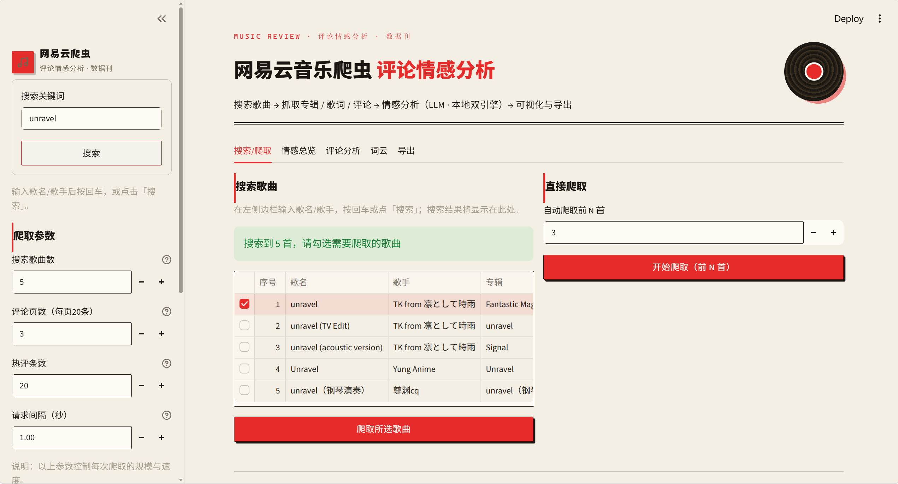

# 网易云音乐爬虫 + 评论情感分析

一个 Python 爬虫项目：搜索并抓取网易云音乐的歌曲信息、专辑名称、歌词内容与评论区评论，
并对每条评论进行情感分析（正面 / 中性 / 负面 + 0~1 情感得分）。
情感分析支持**双引擎切换**：大模型 API（OpenAI 兼容接口）或本地 SnowNLP + 领域词典（完全离线）。

## 功能

- 按关键词搜索歌曲（歌名 / 歌手）
- 抓取歌曲详情：歌名、歌手、专辑名、发布时间、时长
- 抓取歌词全文（LRC）
- 抓取评论区：热评 + 普通评论（按页翻页，支持去重），含点赞数、时间、IP 属地等
- 情感分析双引擎，两种切换方式：
  - **界面切换（推荐）**：Streamlit 侧边栏「情感引擎」单选按钮（本地 SnowNLP / 大模型 LLM），
    切换后无需重启、立即对下一次爬取生效；仅当前会话有效，不写回 `config.json`
  - **配置切换**：修改 `config.json` 的 `sentiment.engine`（使用界面时改后需重启才生效）
  - `llm`：兼容任意 OpenAI 格式接口（DeepSeek / OpenAI / 通义 / 智谱等），分批并发调用
  - `local`：SnowNLP + 音乐评论领域词典混合打分，无需 API Key、完全离线
- Streamlit 可视化：情感总览、评论分析、词云、文件导出
- 结果导出：每首歌一个 JSON + 汇总 `songs.csv` / `comments.csv`
- 会话恢复：运行结果自动保存到 `output/.last_session.json`，刷新浏览器后数据仍保留

## 环境要求

- Python 3.10+
- 依赖：`requests`、`pycryptodome`、`snownlp`（local 引擎）、`streamlit`、`jieba`、`wordcloud`（词云）

## 安装

```bash
pip install -r requirements.txt
```

## 配置

首次运行会自动从 `config.json.example` 生成 `config.json`：

```json
{
  "llm": {
    "base_url": "https://api.deepseek.com/v1",
    "api_key": "sk-你的APIKey",
    "model": "deepseek-chat",
    "timeout": 60
  },
  "crawler": { "request_sleep": 1.0, "max_retries": 3, "timeout": 15 },
  "run": { "max_songs": 5, "comment_pages": 3, "hot_limit": 20 },
  "sentiment": {
    "engine": "local",
    "concurrency": 4,
    "batch_size": 12,
    "enabled": true,
    "local_neg_threshold": 0.4,
    "local_pos_threshold": 0.6
  }
}
```

- `llm.base_url` / `api_key` / `model`：改为你使用的大模型服务（OpenAI 兼容接口）。
- `crawler.request_sleep`：请求间隔秒数，避免触发反爬（请勿调太小）。
- `run.max_songs`：搜索后默认抓取的歌曲数；`run.comment_pages`：每首歌普通评论抓取页数（每页 20 条）；
  `run.hot_limit`：额外抓取的点赞最多热评条数。
- `sentiment.engine`：`llm` 或 `local`（示例默认 `local`，开箱即离线可用；要用大模型改为 `llm` 并填 Key）；
  `sentiment.concurrency` / `batch_size`：大模型并发线程数 / 每批条数。
- `sentiment.local_neg_threshold` / `local_pos_threshold`：local 引擎的中性带阈值
  （得分 ≤ 负阈值判负面，≥ 正阈值判正面，其间为中性）。
- 若 engine 为 `llm` 且未填有效 `api_key`，评论将标注为 `unknown`。
- `config.json` 的 `sentiment.engine` 只是**默认值**：在 Streamlit 界面里可用侧边栏
  「情感引擎」按钮临时切换（仅当前会话生效），无需改文件、无需重启。

## 情感分析引擎：local 与 llm 的区别

### local 引擎原理（`sentiment_local.py`）

local 不是单纯"查词典"，而是**统计模型 + 词典规则**两层混合：

1. **SnowNLP 基线**：SnowNLP 内置朴素贝叶斯情感模型对整条评论给出 0~1 概率分
   （该模型基于商品评论语料训练，直接用于音乐评论存在偏差，如"太好听了"可能被判负面）；
2. **领域词典规则修正**：扫描音乐评论正/负向词（好听、神曲 / 难听、垃圾…），并叠加：
   - 全文**逐处**匹配，否定词窗口为命中前 4 字，奇数个否定词才翻转（"不是不好听"不翻转）；
   - 否定窗口豁免含否定字但不表否定的词（如"莫名"），避免"莫名感到悲伤"被误翻转为正面；
   - 程度副词（太/真/超/死/爆…）加权 ×1.3；
   - 转折子句（但/但是/可是/却/不过/然而 引导）权重 ×1.5，语义重心在后句；
   - 最长词优先并消耗区间，避免"单曲循环/循环"等子串重复计分；
   - 表情符号（👍❤😍😊 / 👎）计入正负向得分；
   - 纯水军标记（打卡/路过/沙发/前排…）且无正负向命中时直接拉回 0.5 中性；
3. **自适应融合判决**：词典分与 SnowNLP 分加权平均，命中越多越信任词典
   （权重 0.6 起步，每多一个命中 +0.1，上限 0.85），最后按阈值切分正/中/负；
4. **无信号向中性收缩**：当词典与表情均无命中时，SnowNLP 属语料外低置信读数，
   得分按 `0.5 + (base - 0.5) × 0.4` 向中性收缩，避免怀旧/中性句（如"居然四年了"）
   被低分误判为负面。

### llm 引擎原理（`sentiment.py`）

将评论全文通过提示词发送给大模型，由模型做**整句语义理解**后返回
JSON `{sentiment, score, reason}`；支持分批（`batch_size`）与并发（`concurrency`），失败自动重试。

### 两者对比

| 维度 | local（SnowNLP+词典） | llm（大模型 API） |
|---|---|---|
| 原理 | 词级统计 + 人工规则 | Transformer 语义理解，读整句上下文 |
| 反讽/反串 | 弱（"好听到我当场删歌"会判正面） | 强，能识别言外之意 |
| 新梗/黑话 | 需手动补词典 | 零样本泛化 |
| 长句推理 | 只看局部窗口 | 全句甚至隐含因果 |
| 速度 | 毫秒级/条，纯 CPU | 每批数百 ms~秒级，受网络与限流约束 |
| 成本 | 免费、离线可用 | 按 token 计费，需有效 API Key |
| 隐私 | 评论不出本机 | 评论文本发送到第三方服务 |
| 确定性 | 完全可复现（同输入同分数） | 有采样温度，重跑可能微差 |
| 可解释性 | reason 为规则轨迹（命中词 + SnowNLP 分） | reason 为模型生成的自然语言解释 |
| 失败模式 | 优雅退化（最坏为中性/unknown） | 网络断、Key 无效、格式不遵守 → unknown |
| 维护 | 需持续补充词典 | 无需维护，换模型即可 |

一句话总结：**local 是"查词+算规则"的浅层方法，快、免费、可复现，但理解不了词以外的东西；
llm 是"读句子"的深层方法，准确率高一个档次，代价是钱、网络和延迟。**

### 选型与调优建议

- 课程作业/演示、评论量大（几千条）、无 API Key → `local`，靠补词典兜底；
- 追求分析质量、评论量在几百条内、有 Key → `llm`；
- local 准确率调优入口：
  1. 调整 `local_neg_threshold` / `local_pos_threshold` 中性带宽（中性判太多就收窄到 0.45/0.55）；
  2. 往 `sentiment_local.py` 的 `POS_WORDS` / `NEG_WORDS` 补充误判词（权重 0.4~1.2）；
  3. 折中方案：local 全量初筛，仅对落在中性带（0.4~0.6）的模糊评论调 llm 复核，成本可降一个数量级。
- local 引擎验证脚本：`python -X utf8 _test_local.py`（含转折/否定/表情/水军等用例）。

两个引擎输出结构完全一致（`{sentiment, score, reason}`），切换引擎后 UI 与导出零改动。

## 可视化界面（Streamlit）

在浏览器中操作整个流程，包含进度反馈、图表可视化与文件下载：

```bash
streamlit run ui.py
# 或双击 run_ui.bat
```

界面包含 5 个标签页：

1. **搜索/爬取**：输入关键词搜索 → 勾选要爬取的歌曲（避免爬到翻唱/AI版），
   或一键"直接爬取前 N 首"；运行中显示进度条 + 滚动日志。侧边栏可调
   搜索歌曲数、评论页数、热评条数、请求间隔等爬取参数，并可用「情感引擎」
   单选按钮在本地 SnowNLP / 大模型 LLM 间切换（仅当前会话生效）。
2. **情感总览**：汇总指标卡、单曲情感分布柱状图 + 占比饼图、各歌曲情感分组柱状图、
   各歌曲平均情感得分横向柱状图（按得分排序；轴上为去重简称，悬停查看完整歌名）。
3. **评论分析**：评论明细表（按歌曲/情感/关键词/点赞筛选）、情感得分分布直方图、
   评论时间分布、热评排行。
4. **词云**：选择歌曲后可生成全部/正面/负面/中性/未知评论的词云（jieba 分词 + wordcloud）。
   词云按评论的情感标签分组，标签质量取决于引擎准确率（local 引擎可补词典/调阈值优化）。
5. **导出**：下载 `songs.csv` / `comments.csv` 及各歌曲 JSON。

大模型 API 配置仍从本地 `config.json` 读取（界面只显示状态，不暴露 api_key）；
情感引擎可在侧边栏临时切换，无需改配置文件、无需重启。

### 界面预览

> 截图存放于 `docs/images/`，文件名与下方引用一致；替换同名文件即可更新预览。

**搜索/爬取**：关键词搜索 → 勾选歌曲 → 一键爬取；侧边栏可调爬取参数与情感引擎。


## 使用（命令行）

```bash
python main.py "毛不易 消愁"
python main.py "周深 大鱼" -n 3 -p 2 -o output
```

参数：
- `keyword`：搜索关键词（位置参数，不传则交互输入）
- `-n / --limit`：搜索并抓取的歌曲数量（默认取配置 `run.max_songs`）
- `-p / --pages`：每首歌普通评论抓取页数（默认取配置 `run.comment_pages`）
- `-o / --out`：输出目录（默认 `output`）

## 项目结构

```
main.py            命令行入口
ui.py              Streamlit 可视化界面（5 个标签页）
pipeline.py        爬取 + 分析 + 导出总流程、配置加载、引擎工厂
netease.py         网易云搜索/详情/歌词/评论爬虫（weapi 加密）
sentiment.py       大模型情感分析引擎（OpenAI 兼容接口）
sentiment_local.py 本地情感分析引擎（SnowNLP + 领域词典）
exporter.py        CSV / JSON 导出
_test_local.py     local 引擎验证脚本
```

## 输出结构

```
output/<关键词>/
├── <song_id>.json     每首歌：歌曲信息 + 歌词全文 + 全部评论（含情感分析结果）
├── songs.csv          歌曲汇总表
└── comments.csv       评论明细表（含 sentiment / sentiment_score）
```

JSON 中每条评论包含：`content`、`nickname`、`liked_count`、`time_str`、`ip_location`、
`sentiment`（positive/neutral/negative/unknown）、`sentiment_score`（0~1）、`sentiment_reason`。

## 提交到 Git 的注意事项

- 仓库已提供 `.gitignore`，**切勿提交 `config.json`**（内含真实 API Key），
  对外只提交模板 `config.json.example`；
- `output/`（爬取产物与会话缓存）、`__pycache__/` 等运行产物均已忽略；
- 若不慎已把含 Key 的 `config.json` 提交过，请立刻到对应服务后台**作废/轮换该 Key**，
  仅从 Git 历史中删除并不等于泄露消除。

## 说明

- 评论接口需要 AES+RSA 加密（weapi），本项目已内置实现，仅依赖 `pycryptodome`。
- 网易云有反爬机制，请合理设置 `request_sleep`，大量采集可能被临时封禁。
- 注意：网易云已无周杰伦等部分歌手的版权，搜索这类歌手只会返回翻唱/AI版本，
  请搜索网易云有版权的歌手/歌曲（如毛不易、薛之谦、周深、汪苏泷等）。
- 本项目仅供学习研究使用，请遵守相关法律法规与平台条款。
